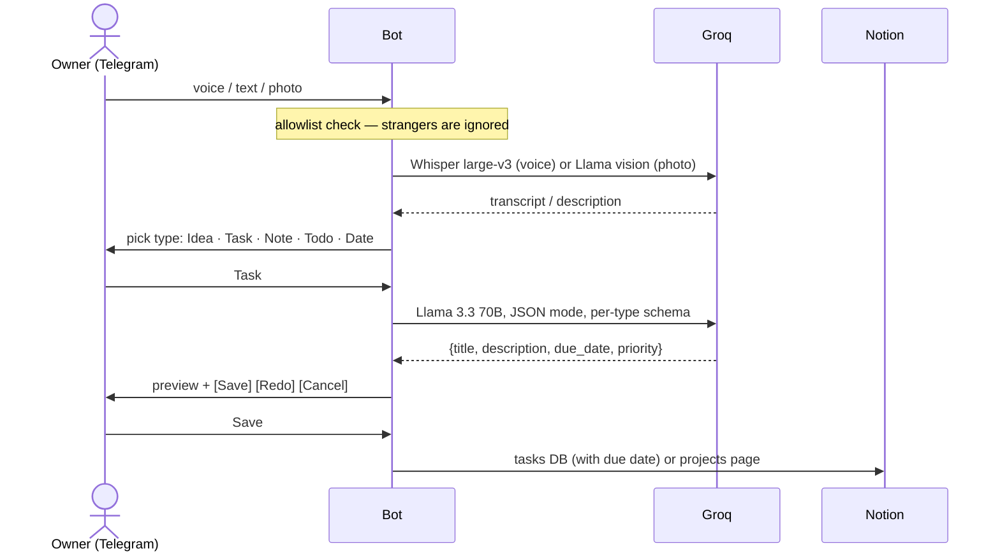

<div align="center">

# second-brain-bot

**Capture ideas, tasks and notes by voice, text or photo in Telegram — structured by an LLM, approved by you, saved to Notion.**

[](https://github.com/faceitall123qwe-hub/second-brain-bot/actions/workflows/ci.yml)


</div>

---

## Flow



| Type | Lands in Notion as |
|---|---|
| 💡 Idea | Page: summary, potential, next step (as a to-do) |
| ✅ Task | Database row with due date and priority |
| 📝 Note | Page with structured markdown and tags |
| ☑️ Todo | Database row with a checklist |
| 📅 Date | Database row dated, with time |

Nothing is written until the owner presses **Save** — the LLM only proposes.

## Run

```bash
pip install -r requirements.txt
cp .env.example .env      # Telegram token, Groq key, Notion token + IDs, ALLOWED_USER_IDS
python bot.py
```

The bot refuses to start without `ALLOWED_USER_IDS` (fail closed).

## Threat model

The bot holds write credentials to a personal knowledge base and spends paid API
quota, and it is reachable by anyone who learns its @username. That shapes the model.

### Assets
- Notion integration token (write access to the shared page and tasks database)
- Groq API key (billable quota)
- Personal context from the Obsidian vault, injected into the system prompt
- Content of the captured notes themselves

### Trust boundaries
1. Telegram users → bot (untrusted network input)
2. Bot → third-party LLM/ASR APIs (data leaves the machine)
3. LLM output → Notion writes (model output is untrusted)

### Threats and controls

| Threat | Control |
|---|---|
| Stranger finds the bot and writes to Notion / burns API quota | `ALLOWED_USER_IDS` allowlist on every message **and** callback handler; the bot refuses to start with an empty list (fail closed) |
| Forged inline-button callbacks from another chat | Callback handlers are wrapped in the same owner check, not only message handlers |
| Prompt injection in a forwarded message, voice note or image text tries to exfiltrate the personal context or write junk | The model has **no tools** and no network or file access; its only output is a JSON preview shown to the owner, and nothing is written until the owner presses *Save* |
| Malformed or oversized LLM output | JSON mode + fixed per-type schema; every Notion rich-text field is truncated to the API limit (2000 chars) |
| Secrets leaking via the repo or logs | Tokens only in `.env` (gitignored); `httpx` logging raised to WARNING because its INFO lines contain the token-bearing Telegram URL |
| Sensitive notes sent to third parties | Documented trade-off: audio, images and text are processed by Groq. Don't capture anything you wouldn't send to a cloud API |
| Temp files with voice/photo data left on disk | Downloads go to `tempfile` and are deleted in `finally` after processing |

### Out of scope / known gaps
- No rate limit per user: acceptable with a single-owner allowlist, required before any
  multi-user use.
- Telegram account takeover of the owner = bot takeover; mitigate with Telegram 2FA.
- No command execution or desktop control by design. If the bot is ever extended with
  tools that act on the local machine, it needs a separate model: an explicit command
  allowlist (no free-form shell), per-action confirmation, a sandboxed low-privilege
  runner, and audit logging.
